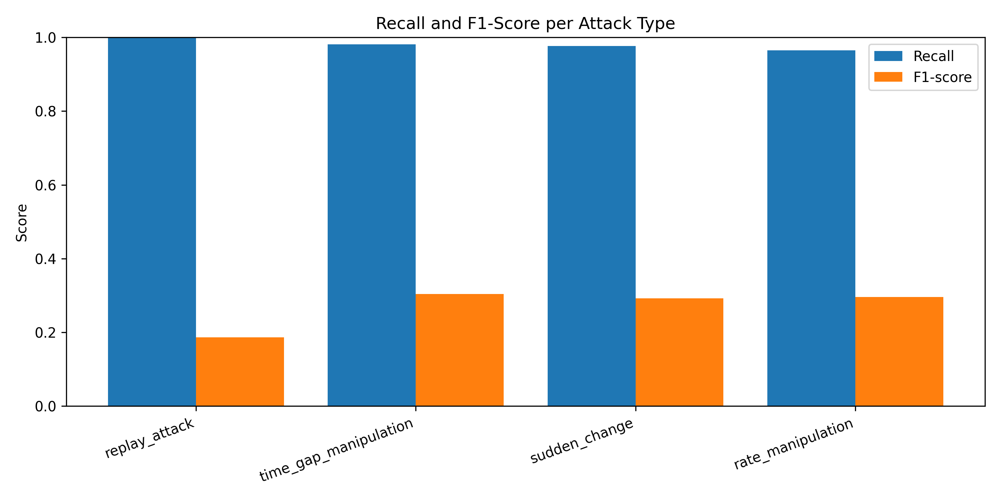

# Secure IoMT Medication Monitoring System

**Bachelor Thesis Project – Applied Computer Science**

## Overview

This project presents a secure Internet of Medical Things (IoMT) medication monitoring system that combines machine learning, cybersecurity mechanisms, and explainable artificial intelligence (XAI) to detect anomalous medication infusion events.

The system was developed using clinical medication administration records from the MIMIC-IV database and evaluates multiple anomaly detection approaches under simulated cyberattack scenarios.

## Key Features

* Medication infusion monitoring
* Machine learning-based anomaly detection
* Explainable AI (XAI) support
* AES encryption for data confidentiality
* HMAC-SHA256 integrity verification
* Replay attack detection
* Interactive Streamlit dashboard
* Security event logging

## Simulated Attack Scenarios

The system evaluates detection performance against four healthcare IoMT attack types:

1. Rate Manipulation
2. Sudden Rate Change
3. Time Gap Manipulation
4. Replay Attack

## Machine Learning Models

* Random Forest
* Logistic Regression
* Isolation Forest
* One-Class SVM
* Autoencoder

## Results

| Metric              | Random Forest |
| ------------------- | ------------- |
| Accuracy            | 95.75%        |
| Recall              | 97.9%         |
| False Negative Rate | 2.1%          |

The Random Forest model achieved the best overall performance and was selected as the final detection model.

### Model Performance Comparison

### Attack Type Analysis

## Technology Stack

* Python
* Pandas
* NumPy
* Scikit-learn
* Streamlit
* Cryptography
* Machine Learning
* Explainable AI

## Dataset

This project uses data derived from the MIMIC-IV clinical database.

The original dataset is not included in this repository due to data usage restrictions.

## Dashboard

The Streamlit dashboard provides:

- Continuous data stream simulation
- Anomaly alerts
- Attack identification
- Security logs
- Rule-based explanations
- Feature importance visualizations

### Dashboard Homepage

### Live Stream Simulation

### Anomaly Detection Example

### Explainable AI (XAI)

### Security Monitoring

## Author

**Nikoletta Andreou**

Bachelor Thesis Project, 2026
